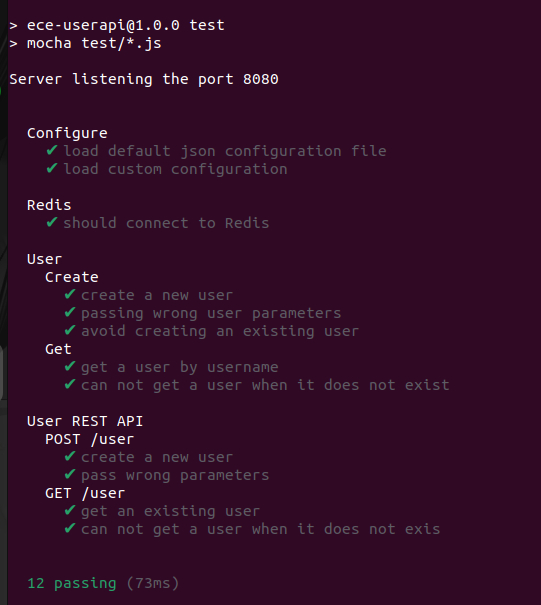
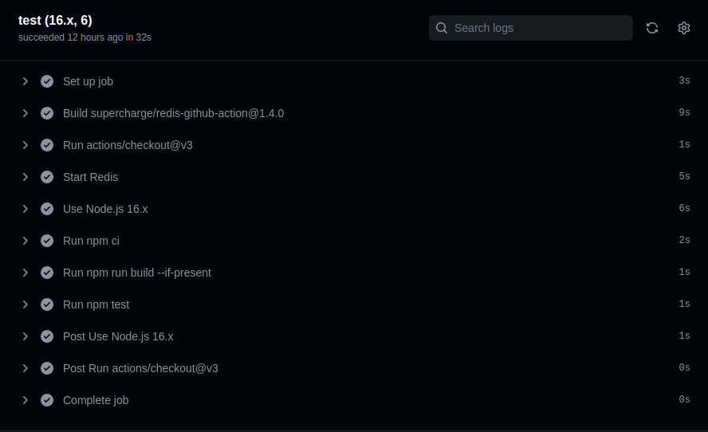
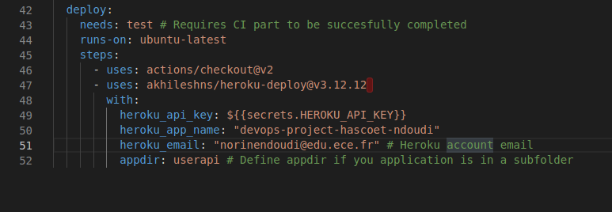
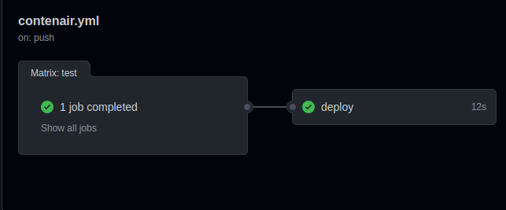
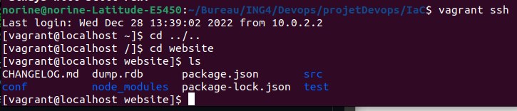
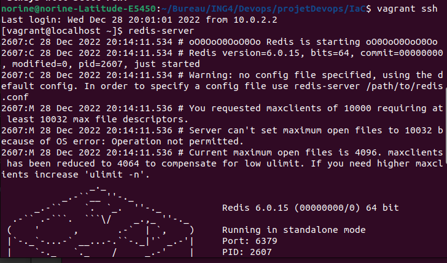
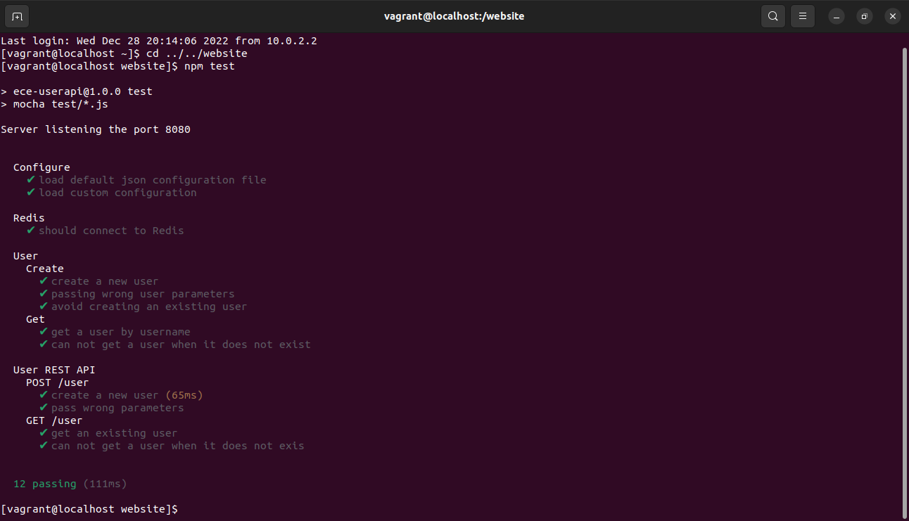
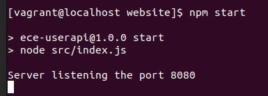
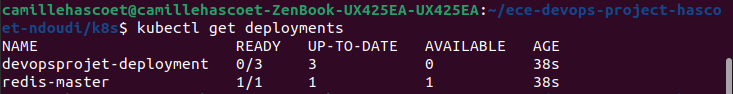

# Projet DevOps Ndoudi & Hascoët

Bienvenue dans le référentiel de notre projet DevOps ! Le but de ce projet est de mettre en oeuvre des logiciels nous permettant une automatisation du développement, des tests, du déploiement d'une application web API utilisant, pour stockage, une base de donnée Redis.


Vous trouverez dans ce référentiel comment vous pourrez mettre en place:

* Une petite application Web API utilisateur
* Une pipeline CI/CD avec GitHub Actions et Heroku
* Une machine virtuelle configurée avec Vagrant et provisionnée avec Ansible
* Une image Docker de l'application
* Une orchestration de conteneurs avec Docker Compose
* Une orchestration docker avec Kubernetes
* Un service mesh utilisant Istio
* Monitoring avec Prometheus et Grafana de l'application conteneurisé sur notre cluster K8s

## Pour commencer
 Clonez ce référentiel depuis votre machine avec HTTPS:
  ```
  git clone https://github.com/Nonoon971/ece-devops-project-hascoet-ndoudi.git

  cd ece-devops-project-hascoet-ndoudi
  ```

  Ou clonez 

## 1. Application Web
 L'application créée est une application web NodeJS API REST où vous pouvez créer un utilisateur, stocker ses informations dans la base de donnée [Redis](https://redis.io/).  
 Pour créer un utilisateur on envoie une méthode curl POST à l'application (ou en utilisant l'application [Postman](https://www.postman.com/).) puis on accède aux données de l'utilisateurs dans la route http://localhost:3000/user/username. Username ayant le nom d'utilisateur créé.

 ### Installation
  Pour créer l'application il vous faudra:

  1. [Installer NodeJS](https://nodejs.org/en/download/)
  2. [Installer Redis](https://redis.io/download)

  3. Installer notre application  
  Pour cela rendez vous dans le dossier `userapi/` et exécuter la commande `npm install`
  ```
  cd userapi
  npm install
  ```

 ### Démarrer Redis

 Dans un terminal, démarrez le serveur Redis avec 
 ```
 redis-server
 ``` 
 Vérifiez ensuite s'il est en cours d'exécution avec
 ```
 redis-cli ping
 ```
 La commande précédente devrait répondre par "PONG"

### Tester l'application
 Rendez-vous dans le répertoire `userapi/`

  Exécutez des tests avec:  
  ```
  npm test
  ```
  Les 12 tests doivent être réussis 

  

### Exécuter l'application
  1. Démarrez l'application:
  ```
  npm start
  ```
  Il démarrera un serveur Web disponible dans votre navigateur à l'adresse http://localhost:3000 .

  2. Créer un utilisateur

  Envoyez une requête post avec le terminal
  ```bash
  curl --header "Content-Type: application/json" \
  --request POST \
  --data '{"username":"sergkudinov","firstname":"sergei","lastname":"kudinov"}' \
  http://localhost:3000/user
  ```
 Il affichera :
 ```
 {"status":"success","msg":"OK"}
 ```
 Après, si vous pouvez aller sur http://localhost:3000/user/sergkudinov , avec "sergkudinov" étant le nom d'utilisateur créé dans les données POST, il affichera dans le navigateur ce qui suit, avec les informations saisies :
 ```
 {"status":"success","msg":{"firstname":"sergei","lastname":"kudinov"}}
 ```

## 2. Pipeline CI/CD avec GitHub Actions et Heroku
 Le workflow pour le continous integration a été effectué avec GitHub Actions, il permet d'automatiser les tests de notre application NodeJS. Ainsi, avant de déployer l'application on vérifie que les tests du workflows réussissent pour s'assurer d'un code fonctionnel.

 Le déploiement a été fait avec Heroku qui permet un déploiement automatique. On ajoute donc Heroku au workflow GitHub Actions et on peut s'assurer du déploiement.

 ### Continuous Integration avec GitHub Actions
  Vous pourrez trouver la configuration du workflow dans le dossier `.github/workflows` contenant le fichier `contenair.yml` que vous pouvez analyser.  
  La partie CI s'effectue jusqu'à la ligne 41. Ainsi lorsque vous vous rendez dans l'onglet "Actions" de notre projet à chaque modification du répertoire par une commande `git push` ou `git pull request` automatiquement le workflow vérifie les tests de notre application et indique si le workflow a échoué ou a réussi
  
  
  

 ### Continuous Deployment avec Heroku
  Le CD s'effectue à partir de la ligne 42 et on utilise Heroku. Le déploiement s'effectue si la partie Continuous Integration a réussi.
 

  La clé API de Heroku provient du paramètre de compte de l'email. Elle a été ensuite ajouté dans les secrets GitHub. Ainsi le déploiement se fait automatiquement sur Heroku après avoir push le projet, une modification sur GitHub.
  

  Après le déploiement effectué, nous pouvons y accèder via le lien Heroku de notre déploiement https://devops-project-hascoet-ndoudi.herokuapp.com/
  

  Cependant, la base de données Redis n'est pas reliée suite au fait que cet outil soit payant. Ainsi l'API utilisateur ne fonctionne pas.

## 3. Configurer et provisionner une machine virtuelle en utilisant l'approche IaC

 Ici nous utilisons Vagrant pour configurer la machine virtuelle et ensuite nous utilisons Ansible pour provisionner la machine.

 ### Installation
  Vous aurez besoin pour cette partie :  
  1. [Installer VirtualBox](https://www.virtualbox.org/wiki/Downloads) (ou autre accepté par Vagrant)
  2. [Installer Vagrant](https://www.vagrantup.com/downloads.html)  

 ### Créer et provisionner la VM
  Rendez-vous dans le dossier `/IaC` où se trouve le Vagrantfile et exécutez dans le terminal la commande suivante :
```bash
vagrant box add centos/7
``` 

Cela affichera:
  
  ```bash
  ==> box: Loading metadata for box 'centos/7'
     box: URL: https://vagrantcloud.com/centos/7
  This box can work with multiple providers! The providers that it can work with are listed below. Please review the list and   choose
  the provider you will be working with.
  1) hyperv
  2) libvirt
  3) virtualbox
  4) vmware_desktop
  Enter your choice: 3
```
Choisissez votre logiciel de virtualisation puis exécutez :
```
vagrant up
```
L'initialisation et le démarrage de votre machine virtuelle devrait commencer.  

Le système d'exploitation de la machine virtuelle est geerlingguy/centos7 contenant VirtualBoxGuest Addition. Si vous souhaitez changer de système il vous suffit de modifier le Vagrant file ligne 16 
```vagrantfile
config.vm.box = "geerlingguy/centos7"
```

Ensuite, approvisionez la VM à l'aide de Ansible avec la commande suivante:
```bash
vagrant provision
```

Ansible se téléchargera et lancera l'approvisionnement mis en place par Ansible-playbook. Les tâches (dossier `tasks`)  téléchargent les packages des services qu'on a besoin (c'est-à-dire Redi et NodeJS) pour exécuter l'application sur la machine virtuelle.

* Lorsque le téléchargement est terminé, vous pouvez accéder à la VM avec SSH en utilisant la commande suivante (toujours dans le répertoire `IaC/`): 
```bash
vagrant ssh 
```
* Le dossier userapi de l'hôte est partagé avec la VM grâce à la propriété de dossier "synced_folder" dans le Vagrantfile .
```vagrantfile
    config.vm.synced_folder "../userapi/", "/website"
```
* En étant dans la VM, vous pouvez donc retrouvé l'application en tapant les commandes suivantes :
```bash
cd ../..
cd website
/website ls
```
Vous verrez donc que les fichiers sont les mêmes que ceux du dossiers de l'hôte.
 

* Pour lancer l'application sur la VM vous devez :  
1. Lancer Redis dans la VM avec `redis-server`

2. Dans un autre terminal, toujours dans la VM, vérifier l'exécution de redis comme précédemment (partie 1) avec `redis-cli ping` qui répondra `PONG`. Ensuite dirigez vous dans le dossier de l'application et exécutez les tests et démarrer l'application:
```bash
cd ../..
cd website
/website npm test
/website npm start
```

  

3. Dans un dernier terminal, dans la VM avec `vagrant ssh` vous pourrez accèder à l'application avec la commande suivante qui vous affichera le contenu de la page:
```bash
curl http://localhost:8080/
```
4. Pour créer un utilisateur vous faites donc la même commande que la première partie mais remplacez le port par 8080 :  
```bash
curl --header "Content-Type: application/json" \
  --request POST \
  --data '{"username":"sergkudinov","firstname":"sergei","lastname":"kudinov"}' \
  http://localhost:8080/user
```


5. Vérifier la création de l'user :
```bash
curl  http://localhost:8080/user/sergkudinov
```


* Vous pouvez sortir de la VM en faisait `CTRL + D` et éteindre la VM avec la commande :
```bash
vagrant halt
```

## 4. Créer une image Docker de l'application
La création d'un docker image nous permet de conteuneriser une application afin qu'une tiers personne puisse utiliser notre application dans l'environnement que nous voulons.

### Récupération de l'image

Installer [Docker Desktop](https://www.docker.com/get-started/)

* Placer dans le root du projet

Vous pouvez executer la ligne suivante:

```bash
docker build -t devops-projet .
```

**N'oubliez pas de mettre le point**

Ou nous avons push notre image docker sur DockerHub


```bash
docker pull camille99/devopsprojet
```

* Verifier que l'image est présente

```bash
docker images
```

* Exécuter le container

```bash
docker run -p 5000:8080 -d camille99/devopsprojet
```

* Vérifier que le container est actif

```bash
docker ps
```
Récupérer l'id du container pour plus tard

* Diriger vous vers http://localhost:5000/

Vous devriez voir cette page s'afficher


* Vous pouvez dès à présent arrêter le container

```bash
docker stop <CONTAINER_ID>
```

## 5. Orchestration des conteneurs à l'aide de Docker Compose
L'image que nous venons de créer précedement ne pouvait pas executer plusieurs container et donc celui de la database

Docker Compose nous permet de créer plusieurs container.

* Executer la commande docker-compose afin de créer et demarrer les container

```bash
docker-compose up
```

* Diriger vous vers http://localhost:5000/ 

Vous devriez voir cette page s'afficher


* Vous pouvez si vous le souhaitez supprimer les containers

```bash
docker-compose rm
```

## 6. Orchestration Docker avec Kubernetes
 Kubernetes est une plate-forme open-source pour les services conteneurisés (et autres) facilitant le déploiement, la mise à l'échelle et la gestion des applications.  
 Pour cette partie, nous aurons besoin de l'outil Minikube

 ### Installer Minikube
  Installer  [Minikube](https://kubernetes.io/docs/tasks/tools/install-minikube/) en suivant votre système d'exploitation (nous vous conseillons aussi la version Bêta).

  * Une fois l'installation terminée, démarrez Minikube avec la commande suivante :
  ```bash
  minikube start
  ```

  * Vous pouvez vérifier que tout est OK avec :
  ```bash
  minikube status
  ```
  * Vous aurez aussi besoin [d'installer kubectl](https://kubernetes.io/fr/docs/tasks/tools/install-kubectl/) selon votre système d'exploitation

 ### Lancer les déploiements Kubernetes

  * Dirigez-vous dans le répertoire `k8s` et lancez la commande suivante pour chaque fichier .yaml:
  ```bash
  kubectl apply -f <file_name.yaml>
  ```
  * Le fichier deployment.yaml décrit un état souhaité dans le déploiement de redis et de l'application userapi et ensuite le contrôleur de déploiement modifie l'état réel en l'état souhaité.

  * Le fichier service.yaml expose les applications redis et userapi s'exécutant sur un ensemble de pods en tant que service réseau

  * Le fichier persistentvolume.yaml est un élément de stockage dans le cluster. Les PV sont des plugins de volume comme Volumes, mais ont un cycle de vie indépendant de tout pod individuel qui utilise le PV. Il capture les détails de l'implémentation du stockage, qu'il s'agisse de NFS, d'iSCSI ou d'un système de stockage spécifique au fournisseur de cloud.

  * Le fichier persistentvolumeclaim.yaml est une demande de stockage par un utilisateur. Il est similaire à un Pod.

### Vérification du bon déroulement

* Vous pouvez vérifier les deploiements :
```bash
kubectl get deployments
```



* Vous pouvez vérifier les services :
```bash
kubectl get services
```

Voici ce que vous devri


* Vous pouvez vérifier le persistent volume :
```bash
kubectl get pv
```


* Vous pouvez vérifier le persistent volume claim :
```bash
kubectl get pvc
```


### Accés à l'application

* Exécuter la commande suivante

```bash
minikube service devopsprojet-service
```

La page web s'ouvrira d'elle-même avec le bon port. 

Ceci devrait s'afficher dans votre navigateur 


Ceci devrait s'afficher dans votre terminal


## 7. Service mesh avec Istio
 Istio est une plateforme de Service Mesh permettant de contrôler la manière dont les données sont partagées entre les micro-services.

 ### Installation
 Installer Minikube si ce n'est déjà fait et exécutez :
 - `minikube config set driver docker`
 - `minikube start --memory=10000 --cpus=4 --kubernetes-version=v1.20.2`
 - `minikube tunnel`

 > **Note!** Si vous n'avez pas **assez de RAM** à allouer à la VM de minikube, alors essayer de mettre le maximum que vous avez sur votre ordinateur.

 [Suivez les instructions d'installation](https://istio.io/latest/docs/setup/getting-started/) jusqu'à la partie `Deploy the sample application
`
 ### Déployer les fichiers yaml
 Nous avons créé une configuration afin de router, déterminer le chemin des requêtes entre 2 versions différentes de notre application.  
 Le fichier `deployment.yaml` se trouvant dans le dossier `istio/` comporte donc 4 déploiements : La version "v1" et la version v2 du déploiements de l'application (nommé devops-projet) et redis.

 * Dirigez-vous dans le dossier `istio/` pour chaque fichier du dossier :
 ```bash
  kubectl apply -f <file_name.yaml>
```
 ### Routage
 Nous avons effectué un **routage basé sur l'identité de l'utilisateur** avec le fichier `virtual-service-route.yaml` où les connexions avec le nom d'utilisateur correspondant à camzzz en requete HTTP seront envoyé à la version 2

 ### Déplacement du traffic
 Le fichier `virtual-service-traffic.yaml` applique un service virtuel redirigeant 50% du trafic vers la version 1 du déploiement de l'application et les 50% qui restent vers la version 2.

## 8. Monitoring avec Prometheus et Grafana de l'application conteneurisé sur notre cluster K8s

## Contributeurs
- NDOUDI Norine <norine.ndoudi@edu.ece.fr>
- HASCOËT Camille <camille.hascoet@edu.ece.fr>


## Bibliographie

Front-End de l'application : https://codeforgeek.com/render-html-file-expressjs/

Playbook role pour installer nodeJS avec Ansible : https://gist.github.com/ikr0m/ab1b6ad92dcde00cc4e17125d28e82df