# DevOps Project Ndoudi & Hascoët

Welcome to our DevOps project repository! The aim of this project is to implement software enabling us to automate the development, testing and deployment of a web API application using a Redis database for storage.

You will find in this repository how you can set up:

* A small user API Web application
* A CI/CD pipeline with GitHub Actions and Heroku
* A virtual machine configured with Vagrant and provisioned with Ansible
* A Docker image of the application
* Container orchestration with Docker Compose
* Docker orchestration with Kubernetes
* A mesh service using Istio
* Monitoring with Prometheus and Grafana of the containerized application on our K8s cluster

## Getting started
 Clone this repository from your machine using HTTPS:
  ```
  git clone https://github.com/Nonoon971/ece-devops-project-hascoet-ndoudi.git

  cd ece-devops-project-hascoet-ndoudi
  ```

## 1. Web application
The application created is a NodeJS API REST web application where you can create a user and store his information in the [Redis] database (https://redis.io/).  
To create a user, send a curl POST method to the application (or use the [Postman](https://www.postman.com/) application), then access the user's data in the http://localhost:3000/user/username route. Username with the user name created.

### Installation
  To create the application you will need:

  1. [Install NodeJS](https://nodejs.org/en/download/)
  2. [Install Redis](https://redis.io/download)

  3. Install our application  
  To do this, go to the `userapi/` folder and run the command `npm install`.
  ```
  cd userapi
  npm install
  ```

 ### Start Redis

 In a terminal, start the Redis server with 
 ```
 redis-server
 ``` 
 Then check that it's running with
 ```
 redis-cli ping
 ```
 The previous command should respond with “PONG”.

### Testing the application
 Go to the `userapi/` directory

  Run tests with:  
  ```
  npm test
  ```
  All 12 tests must pass 

  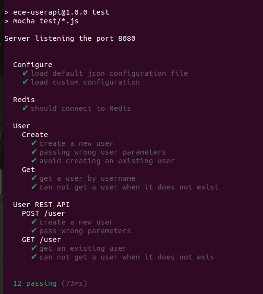

### Run the application
  1. Start the application:
  ```
  npm start
  ```
  It will start a Web server available in your browser at http://localhost:3000 .

  2. Create a user

  Send a post request with the terminal
  ```bash
  curl --header “Content-Type: application/json” \
  --request POST
  --data '{“username”: “sergkudinov”, “firstname”: “sergei”, “lastname”: “kudinov”}' \
  http://localhost:3000/user
  ```
 It will display :
 ```
 {“status”:“success”,“msg”:“OK”}
 ```
 Afterwards, if you can go to http://localhost:3000/user/sergkudinov , with “sergkudinov” being the username created in the POST data, it will display in the browser the following, with the information entered:
 ```
 {“status”: “success”, “msg”:{“firstname”: “sergei”, “lastname”: “kudinov”}}
 ```

## 2. CI/CD pipeline with GitHub Actions and Heroku
The workflow for continuous integration was created using GitHub Actions, which automates the testing of our NodeJS application. So, before deploying the application, we check that the workflow tests pass to ensure that the code is functional.

Deployment was carried out using Heroku, which enables automatic deployment. So we add Heroku to the Actions GitHub workflow, and we can be sure of deployment.

### Continuous Integration with GitHub Actions
You can find the workflow configuration in the `.github/workflows` folder, which contains the `contenair.yml` file for analysis.  
The CI part goes up to line 41. So when you go to the “Actions” tab of our project, each time the directory is modified by a `git push` or `git pull request` command, the workflow automatically checks our application's tests and indicates whether the workflow has failed or succeeded
  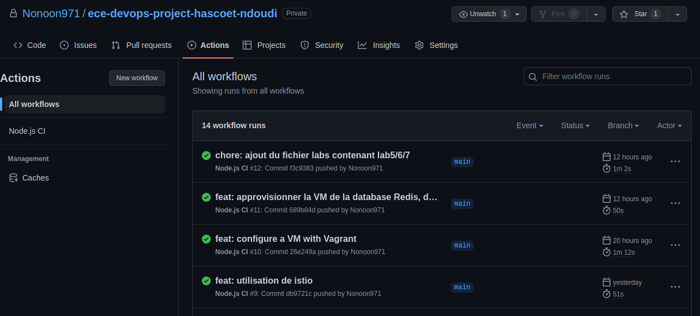
  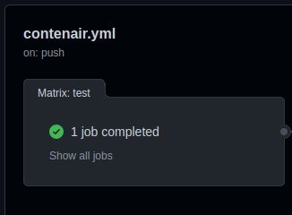
  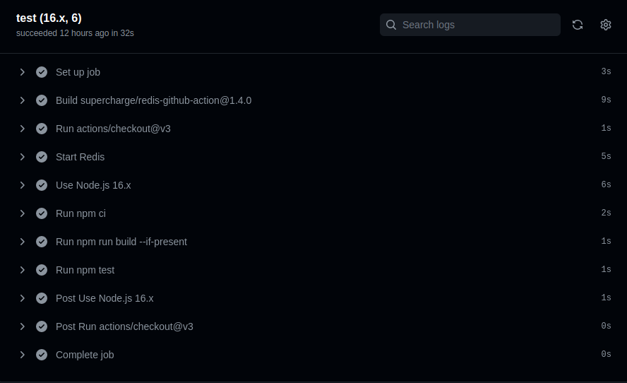

### Continuous Deployment with Heroku
  The CD is made from line 42 and Heroku is used. Deployment takes place if Continuous Integration is successful.
 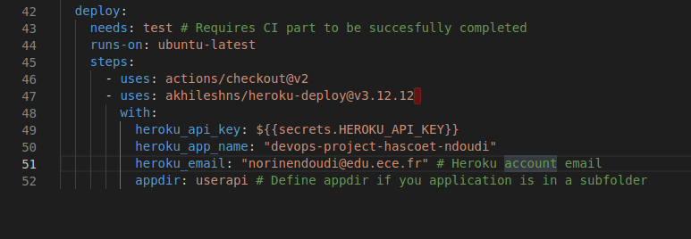

  The Heroku API key comes from the email account parameter. It was then added to the GitHub secrets. This means that deployment takes place automatically on Heroku after pushing the project, a modification on GitHub.
  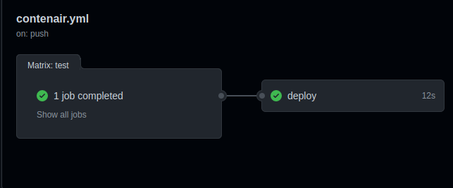

  Once deployed, we can access it via the Heroku link of our deployment https://devops-project-hascoet-ndoudi.herokuapp.com/
  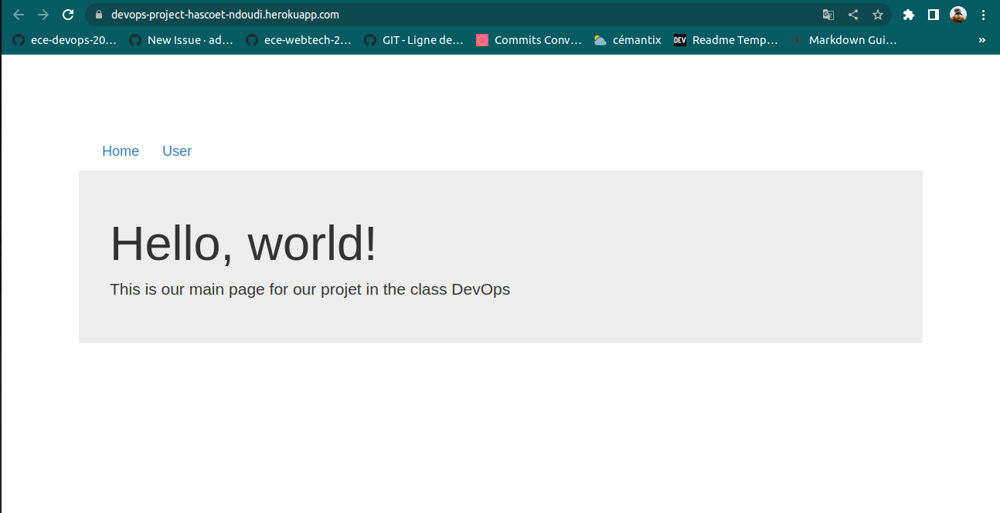

  However, the Redis database is not linked, due to the fact that this tool has to be paid for. So the user API doesn't work.

## 3. Configuring and provisioning a virtual machine using the IaC approach

 Here we use Vagrant to configure the virtual machine and then we use Ansible to provision the machine.

 ### Installation
  For this part, you'll need :  
  1. [Install VirtualBox](https://www.virtualbox.org/wiki/Downloads) (or another accepted by Vagrant)
  2. [Install Vagrant](https://www.vagrantup.com/downloads.html)  

 ### Create and provision the VM
  Go to the `/IaC` folder where the Vagrantfile is located and run the following command in the terminal:
```bash
vagrant box add centos/7
``` 

This will display:

```bash
  ==> box: Loading metadata for box 'centos/7'
     box: URL: https://vagrantcloud.com/centos/7
  This box can work with multiple providers! The providers that it can work with are listed below. Please review the list and   choose
  the provider you will be working with.
  1) hyperv
  2) libvirt
  3) virtualbox
  4) vmware_desktop
  Enter your choice: 3
```
Choose your virtualization software and run :
```
vagrant up
```
Initialization and start-up of your virtual machine should begin.  

The virtual machine's operating system is geerlingguy/centos7 containing VirtualBoxGuest Addition. If you wish to change operating system, simply modify the Vagrant file line 16 
vagrantfile
config.vm.box = “geerlingguy/centos7
```

Then provision the VM using Ansible with the following command:
```bash
vagrant provision
```

Ansible will download and launch the provisioning set up by Ansible-playbook. The tasks (`tasks` folder) download the service packages we need (i.e. Redi and NodeJS) to run the application on the virtual machine.

* When the download is complete, you can access the VM with SSH using the following command (still in the `IaC/` directory): 
```bash
vagrant ssh 
```
* The host's userapi folder is shared with the VM thanks to the “synced_folder” folder property in the Vagrantfile .
```vagrantfile
    config.vm.synced_folder “../userapi/”, “/website”
```
* While in the VM, you can retrieve the application by typing the following commands:
```bash
cd ../..
cd website
/website ls
```
You'll see that the files are the same as those in the host folder.
 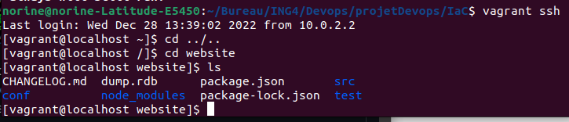

* To launch the application on the VM you need to :  
1. Launch Redis in the VM with `redis-server`.
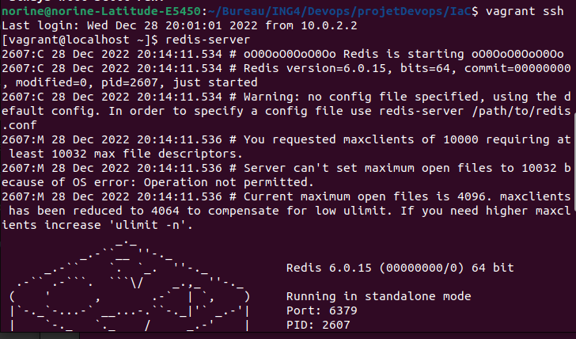
2. In another terminal, still in the VM, check that redis is running as before (part 1) with `redis-cli ping`, which will reply `PONG`. Then go to the application folder and run the tests and start the application:
``bash
cd ../..
cd website
/website npm test
/website npm start
```
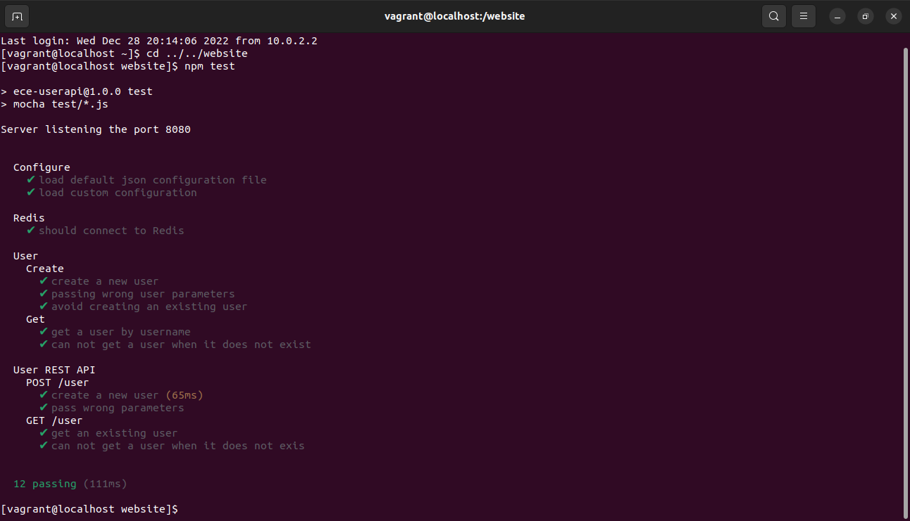


3. In a final terminal, in the VM with `vagrant ssh` you can access the application with the following command, which will display the contents of the page:
``bash
curl http://localhost:8080/
```
4. To create a user, use the same command as above, but replace the port with 8080 :  
```bash
curl --header “Content-Type: application/json” \
  --request POST
  --data '{“username”: “sergkudinov”, “firstname”: “sergei”, “lastname”: “kudinov”}' \
  http://localhost:8080/user
```
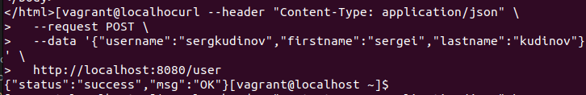

5. Check user creation:
```bash
curl http://localhost:8080/user/sergkudinov
```
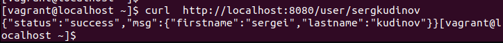

* You can exit the VM by pressing `CTRL + D` and shut down the VM with the command :
```bash
vagrant halt
```
## 4. Creating a Docker image of the application
Creating a docker image allows us to conteunerize an application so that a third party can use our application in the environment we want.

### Retrieving the image

Install [Docker Desktop](https://www.docker.com/get-started/)

* Place in project root

You can execute the following line:

```bash
docker build -t devops-projet .
```

**Don't forget to put the dot**.

Or push our docker image to DockerHub

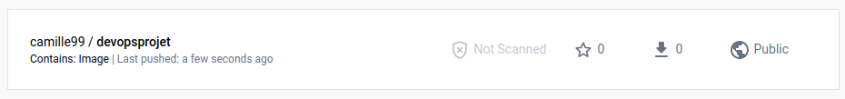

```bash
docker pull camille99/devopsprojet
```

* Verify that the image is present

```bash
docker images
```

* Run the container

```bash
docker run -p 5000:8080 -d camille99/devopsprojet
```

* Check that the container is active

```bash
docker ps
```
Get the container id for later

* Go to http://localhost:5000/

You should see this page


* You can now stop the container

```bash
docker stop <CONTAINER_ID>
```

## 5. Container orchestration using Docker Compose
The image we've just created couldn't run multiple containers, and so the database image was not able to run multiple containers.

Docker Compose lets us create multiple containers.

* Execute the docker-compose command to create and start the containers

```bash
docker-compose up
```

* Go to http://localhost:5000/ 

You should see this page


* If you wish, you can delete the containers

```bash
docker-compose rm
```

## 6. Docker orchestration with Kubernetes
 Kubernetes is an open-source platform for containerized (and other) services, making it easy to deploy, scale and manage applications.  
 For this part, we'll need the Minikube tool

 ### Install Minikube
  Install [Minikube](https://kubernetes.io/docs/tasks/tools/install-minikube/) according to your operating system (we also recommend the Beta version).

  * Once the installation is complete, start Minikube with the following command:
  ```bash
  minikube start
  ```

  * You can check that everything is OK with :
  ```bash
  minikube status
  ```
  * You'll also need to [install kubectl](https://kubernetes.io/fr/docs/tasks/tools/install-kubectl/) depending on your operating system.

### Launch Kubernetes deployments

  * Go to the `k8s` directory and run the following command for each .yaml file:
  ```bash
  kubectl apply -f <file_name.yaml>
  ```
  * The deployment.yaml file describes a desired state in the deployment of redis and the userapi application and then the deployment controller changes the actual state to the desired state.

  * The service.yaml file exposes the redis and userapi applications running on a set of pods as a network service.

  * The persistentvolume.yaml file is a storage element in the cluster. PVs are volume plugins like Volumes, but have a lifecycle independent of any individual pod that uses the PV. It captures the details of the storage implementation, whether NFS, iSCSI or a cloud provider-specific storage system.

  * The persistentvolumeclaim.yaml file is a storage request by a user. It is similar to a Pod.

### Checking that everything is running smoothly

* You can check the deployments:
```bash
kubectl get deployments
```

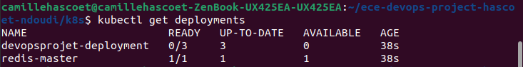

* You can check services:
```bash
kubectl get services
```

Here's what you should see
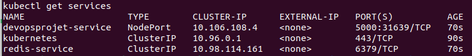

* You can check the persistent volume:
```bash
kubectl get pv
```

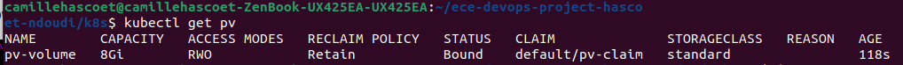

* You can check the persistent volume claim:
```bash
kubectl get pvc
```


### Accessing the application

* Execute the following command

```bash
minikube service devopsprojet-service
```

The web page will open itself with the correct port. 

This should appear in your browser 

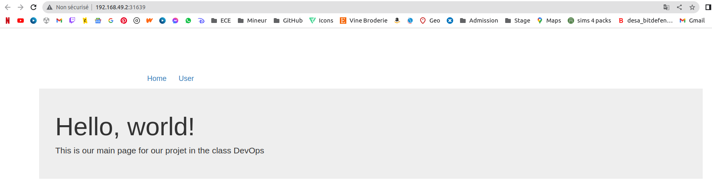

This should be displayed in your terminal
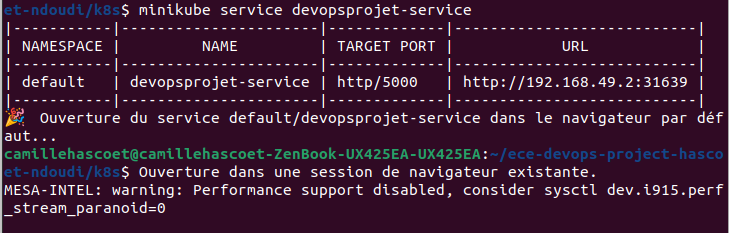

## 7. Service mesh with Istio
 Istio is a Service Mesh platform for controlling the way data is shared between microservices.

 ### Installation
 Install Minikube if you haven't already and run :
 - `minikube config set driver docker`
 - `minikube start --memory=10000 --cpus=4 --kubernetes-version=v1.20.2`
 - `minikube tunnel`

 > **Note!** If you don't have **enough RAM** to allocate to the minikube VM, then try using as much as you have on your computer.

 [Follow the installation instructions (https://istio.io/latest/docs/setup/getting-started/) until you reach the `Deploy the sample application`
 ### Deploy yaml files
 We've created a configuration to route requests between 2 different versions of our application.  
 The `deployment.yaml` file in the `istio/` folder therefore contains 4 deployments: Version “v1” and version v2 of the application deployment (named devops-projet) and redis.

 * Go to the `istio/` folder for each file in the :
 ```bash
  kubectl apply -f <file_name.yaml>
```
 ### Routing
 We've performed **routing based on user identity** with the `virtual-service-route.yaml` file, where connections with the username corresponding to camzzz in HTTP request will be sent to version 2.

 ### Moving traffic
 The `virtual-service-traffic.yaml` file applies a virtual service redirecting 50% of traffic to version 1 of the application deployment and the remaining 50% to version 2.

 ## 8. Monitoring with Prometheus and Grafana of the containerized application on our K8s cluster

## Contributors
- NDOUDI Norine <norine.ndoudi@edu.ece.fr>
- HASCOËT Camille <camille.hascoet@edu.ece.fr>


## Bibliography

Front-End application: https://codeforgeek.com/render-html-file-expressjs/

Playbook role for installing nodeJS with Ansible: https://gist.github.com/ikr0m/ab1b6ad92dcde00cc4e17125d28e82df
